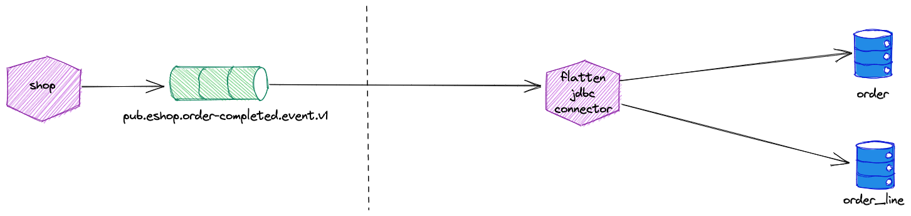

# Writing data from Kafka to RDBMS (Oracle)

In this demo we will be .... 

The following diagram shows the setup of the data flow which will be implemented step by step. Of course we will not be using real-life data, but have a program simulating trucks and their driving behaviour.


We will see various technologies in action, such as **Kafka**, **MQTT**, **Kafka Connect**, **Kafka Streams** and **ksqlDB**.

## Preparation

The platform where the demos can be run on, has been generated using the [`platys`](http://github.com/trivadispf/platys) toolset using the [`platys-modern-data-platform`](http://github.com/trivadispf/platys-modern-data-platform) stack.

The generated artefacts are available in the `./docker` folder.

The prerequisites for running the platform are [**Docker**](https://www.docker.com/) and [**Docker Compose**](https://docs.docker.com/compose/).

The environment is completely based on docker containers. In order to easily start the multiple containers, we are going to use Docker Compose. You need to have at least 12 GB of RAM available, but better is 16 GB.

### Start the platform using Docker Compose

First, create the following two environment variables, which export the Public IP address (if a cloud environment) and the Docker Engine (Docker Host)  IP address:

``` bash
export DOCKER_HOST_IP=<docker-host-ip>
export PUBLIC_IP=<public-host-ip>
```

You can either add them to `/etc/environment` (without export) to make them persistent or use an `.env` file inside the `docker` folder with the two variables.

It is very important that these two are set, otherwise the platform will not run properly.

Now navigate into the `docker` folder and start `docker-compose`.

``` bash
cd ./docker

docker-compose up -d
```

To show all logs of all containers use

``` bash
docker-compose logs -f
```

To show only the logs for some of the containers, for example `kafka-connect-1` and `kafka-connect-2`, use

``` bash
docker-compose logs -f kafka-connect-1 kafka-connect-2
```

If you want to stop the platform (all containers), run

``` bash
docker-compose down
```

Some services in the `docker-compose.yml` are optional and can be removed, if you don't have enough resources to start them. 

As a final step, add `dataplatform` as an alias to the `/etc/hosts` file so that the links used in this document work. 

```
<public-host-ip>		dataplatform
```

If you have no rights for doing that, then you have to use your IP address instead of `dataplatform` in all the URLs.  

### Available Services 

For a list of available services, navigate to <http://dataplatform:80/services>.

When a terminal is needed, you can use the Web Terminal available at <http://dataplatform:3001/>.

### Creating the necessary Kafka Topics

The Kafka cluster is configured with `auto.topic.create.enable` set to `false`. Therefore we first have to create all the necessary topics, using the `kafka-topics` command line utility of Apache Kafka. 

From a terminal window, use the `kafka-topics` CLI inside the `kafka-1` docker container to create the topics `vehicle_tracking_` and `logisticsdb_driver `.

``` bash
docker exec -it kafka-1 kafka-topics --bootstrap-server kafka-1:19092 --create --topic vehicle_tracking_sysA --partitions 8 --replication-factor 3

docker exec -it kafka-1 kafka-topics --bootstrap-server kafka-1:19092 --create --topic vehicle_tracking_sysB --partitions 8 --replication-factor 3
```

If you don't like to work with the CLI, you can also create the Kafka topics using the graphical user interfaces [Cluster Manager for Kafka (CMAK)](http://dataplatform:28104) or the [Apache Kafka HQ (AKHQ)](http://dataplatform:28107). 


## Implementation

### Solution 3 - ksqlDB and Kafka Connect JDBC Connector to Oracle tables


```sql
DROP STREAM IF EXISTS sol3_priv_dwh_order_s;
DROP STREAM IF EXISTS sol3_priv_dwh_order_line_s;
DROP STREAM IF EXISTS sol3_pub_order_completed_event_s;

CREATE OR REPLACE STREAM sol3_pub_order_completed_event_s
	WITH (KAFKA_TOPIC='pub.eshop.order-completed.event.v1',
		  VALUE_FORMAT='AVRO',
		  KEY_FORMAT='KAFKA'
		  );


CREATE OR REPLACE STREAM sol3_priv_dwh_order_s 
	WITH (KAFKA_TOPIC='sol3_priv.dwh.order.v1',
		  VALUE_FORMAT='AVRO',
		  KEY_FORMAT='KAFKA'
		  )
AS
SELECT order->id AS id
, order->customerId AS customer_id
, order->orderDate AS order_date
FROM sol3_pub_order_completed_event_s;		  


CREATE OR REPLACE STREAM sol3_priv_dwh_order_line_s 
	WITH (KAFKA_TOPIC='sol3_priv.dwh.order_line.v1',
		  VALUE_FORMAT='AVRO',
		  KEY_FORMAT='KAFKA'
		  )
AS
SELECT concat(concat(CAST(EXPLODE(order->orderLines)->lineId AS STRING), ':'), order->id) AS ID
, EXPLODE(order->orderLines)->lineId  AS line_id
, order->id AS order_id
, EXPLODE(order->orderLines)->productId AS product_id
, EXPLODE(order->orderLines)->quantity AS quantity
FROM sol3_pub_order_completed_event_s;	
```

```bash
curl -X "POST" "$DOCKER_HOST_IP:8083/connectors" \
     -H "Content-Type: application/json" \
     -d $'{
  "name": "sol3-jdbc-sink-connector",
  "config": {
    "connector.class": "io.confluent.connect.jdbc.JdbcSinkConnector",
    "tasks.max": "1",
    "topics.regex": "sol3_priv.dwh.*",
    "connection.url": "jdbc:oracle:thin:@//oracledb-xe:1521/XEPDB1",
    "connection.user": "ecomm_sales",
    "connection.password": "abc123!",
    "connection.ds.pool.size": 5,
    "quote.sql.identifiers":"never",
    "auto.create":"true",
    "auto.evolve":"false",
    "insert.mode": "upsert",
    "insert.mode.databaselevel": true,
    "pk.mode": "record_value",
    "pk.fields": "ID",
    "key.converter":"org.apache.kafka.connect.storage.StringConverter",
    "key.converter.schemas.enable": "false",
    "value.converter":"io.confluent.connect.avro.AvroConverter",
    "value.converter.schema.registry.url": "http://schema-registry-1:8081",
    "value.converter.schemas.enable": "false",
    "transforms": "route,topicCase",
    "transforms.route.regex": "sol3_priv.dwh.(.*).v1",
    "transforms.route.replacement": "SOL3_$1_T",
    "transforms.route.type": "org.apache.kafka.connect.transforms.RegexRouter",
    "transforms.topicCase.type": "com.github.jcustenborder.kafka.connect.transform.common.ChangeTopicCase",
    "transforms.topicCase.from": "LOWER_UNDERSCORE",
    "transforms.topicCase.to": "UPPER_UNDERSCORE"        
    }
}'
```

### Solution 4 - Kafka Connect JDBC Connector with Flatten to Oracle tables




### Solution 6 - Kafka Connect to Oracle JSON View with PL/SQL Instead-of-Trigger to Oracle Tabellen


```sql
DROP TABLE sol6_order_aggr_t;

CREATE TABLE sol6_order_aggr_t (id VARCHAR2(100) PRIMARY KEY
									, json_string CLOB
									, offset NUMBER(10)
									, timestamp TIMESTAMP
									, topic VARCHAR2(20));
```

```sql
DROP TABLE sol6_order_line_t;
DROP TABLE sol6_order_t;

CREATE TABLE sol6_order_t (id VARCHAR2(100) PRIMARY KEY
							, customer_id NUMBER(32)
							, order_date TIMESTAMP);

CREATE TABLE sol6_order_line_t (id VARCHAR2(100) PRIMARY KEY
									, order_id VARCHAR2(100)
									, product_id NUMBER(32)
									, quantity NUMBER(3));
									
ALTER TABLE sol6_order_line_t 
	ADD CONSTRAINT sol6_fk_ordl_ord FOREIGN KEY (order_id)
	  REFERENCES sol6_order_t (id);
```

```sql
CREATE OR REPLACE VIEW sol6_order_aggr_v 
AS 
SELECT id
,      json_string
, 		offset
, 		timestamp 
,	   topic
FROM sol6_order_aggr_t;
```

```sql
CREATE OR REPLACE TRIGGER sol6_order_aggr_iot
INSTEAD OF INSERT OR UPDATE ON sol6_order_aggr_v
DECLARE
BEGIN
   INSERT INTO sol6_order_aggr_t (id, json_string, offset, timestamp, topic)
   VALUES(:NEW.id, :NEW.json_string, :NEW.offset, :NEW.timestamp, :NEW.topic);
   
   INSERT INTO sol6_order_t (id, customer_id, order_date)
   SELECT id, customer_id, TO_TIMESTAMP(order_date, 'YYYY-MM-DD"T"HH24:MI:SS.FF"Z"') 
   FROM json_table (:NEW.json_string FORMAT JSON, '$.order'
        COLUMNS (
            id VARCHAR2 PATH id,
            customer_id NUMBER PATH customerId,
            order_date VARCHAR2 PATH orderDate));

   INSERT INTO sol6_order_line_t (id, order_id, product_id, quantity)
   SELECT order_id || ':' || id, order_id, product_id, quantity
   FROM json_table (:NEW.json_string FORMAT JSON, '$.order'
        COLUMNS (
            order_id VARCHAR2 PATH id,
            NESTED PATH '$.orderLines[*]' 
            COLUMNS
                (id NUMBER PATH lineId,
                product_id NUMBER PATH productId,
                quantity NUMBER PATH quantity)));

END sol6_order_aggr_iot;

```


```bash
curl -X "POST" "$DOCKER_HOST_IP:8083/connectors" \
     -H "Content-Type: application/json" \
     -d $'{
  "name": "sol6-jdbc-sink-connector",
  "config": {
    "connector.class": "io.confluent.connect.jdbc.JdbcSinkConnector",
    "tasks.max": "1",
    "topics.regex": "pub.eshop.order-completed.event.v1",
    "connection.url": "jdbc:oracle:thin:@//oracledb-xe:1521/XEPDB1",
    "connection.user": "ecomm_sales",
    "connection.password": "abc123!",
    "connection.ds.pool.size": 5,
    "table.name.format": "SOL6_ORDER_AGGR_V",
    "table.types": "VIEW",
    "quote.sql.identifiers":"never",
    "auto.create":"false",
    "auto.evolve":"false",
    "pk.mode": "record_key",
    "pk.fields":"id",
    "key.converter":"org.apache.kafka.connect.storage.StringConverter",
    "key.converter.schemas.enable": "false",
    "value.converter":"io.confluent.connect.avro.AvroConverter",
    "value.converter.schema.registry.url": "http://schema-registry-1:8081",
    "value.converter.schemas.enable": "false",
    "transforms": "ToJson,InsertField",
    "transforms.ToJson.json.string.field.name": "json_string",
    "transforms.ToJson.json.writer.output.mode": "RELAXED",
    "transforms.ToJson.type": "com.github.cedelsb.kafka.connect.smt.Record2JsonStringConverter$Value",  
    "transforms.ToJson.json.writer.handle.logical.types": "true",
    "transforms.ToJson.json.writer.datetime.logical.types.as": "STRING",
    "transforms.InsertField.type": "org.apache.kafka.connect.transforms.InsertField$Value",
    "transforms.InsertField.offset.field": "offset",
    "transforms.InsertField.timestamp.field": "timestamp",
    "transforms.InsertField.topic.field": "topic"
    }
}'
```
